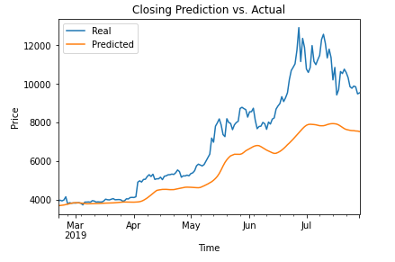

# LSTM Stock Predictors

## Process

-----

## Results

### Which model had a lower loss?

Sentiment - 0.1495

Closing - 0.0569

### Which model tracks the values better over time?

### Which window size works best for the models?

