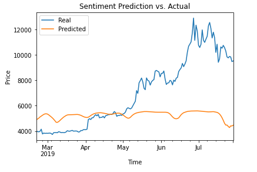

# LSTM Stock Predictors

## Process

This project called for two prediciton models to be created to determine if solid closing price data or sentiment data from social media provides a better ground for a LSTM prediction model.  

The same source data of daily Bitcoin prices was used to ensure consistency between the two models.  Both were created utilizing a 70/30 split of training and testing data to allow for a solid learning base but prevent the potential for overfitting.  

Once the models were completed and ran successfully, timeframes were adjusted to find the optimal testing window for each method.  Results of the testing can be found below.

-----

## Results

### Which model had a lower loss?
- The closing Cost Prediction Model had a loss ratio just about a third the size of the Sentiment Prediction Model.  The Cost Model came in with a ratio of .0569 compared to the Sentiment Model with a ratio of .1495.

### Which model tracks the values better over time?

- As shown in the charts below (Window of 10), the Closing Prediciton Model has a closer value predition than the Sentiment Prediction Model.  Showing historical data as being a stronger indicator of performance than public perception.

### Which window size works best for the models?

For both of the Prediction Models, the fewer windows allowed, the better the loss ratio.  
- For the Closing Prediction Model, dropping from 10 windows to 5 reduced the loss raio to an even 0.0400, while reducing even further to 1 window allowed for a ratio of 0.0210.
- For the Sentiment Prediction Model, the reductions were not as drastic, but still notable.  A drop to 5 windows allowed for a loss ratio of 0.1379, while a window of 1 brought the ratio down to 0.1258
